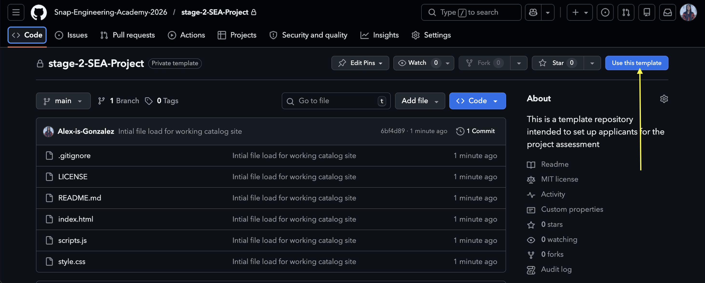

# SEA Stage 2 - Data Catalog Project

This repository contains the instructions, requirements, and starter code for Stage Two of the Snap Engineering Academy application process.

---

## 📚 Table of Contents

- [Your Task](#your-task)
- [Requirements](#requirements---your-catalog-website-should)
- [Getting Started](#getting-started)
- [Submitting](#submitting)
- [❓ Frequently Asked Questions (FAQ)](#-frequently-asked-questions-faq)

---

## 🎯 Your Task

### 
Create a "catalog" website for something you're passionate about.

> 📝 **Note:**  
> If you have not used GitHub or programmed a website with JavaScript before, that's OK! Part of the challenge is figuring out things you're not familiar with.

---

## ✅ Requirements - Your Catalog Website Should...

- Show off your understanding of basic data structures: [**arrays**](https://www.w3schools.com/js/js_arrays.asp) and [**objects**](https://developer.mozilla.org/en-US/docs/Web/JavaScript/Guide/Working_with_objects).
- Display a **substantial amount of interesting data** in a "catalog". You can look online for datasets or create your own. Make sure you import the data yourself and are not fetching an API.
  - Your data should be easy to find in your source code—either in variables at the top of `scripts.js` or imported from a file.
- Include **two or more features** that **operate** on your data and modify how the data is displayed. Examples of features that operate on your data are:
  - Filtering
  - Searching
  - Sorting
  - Updating
  - Adding/removing entries  
    Think about what users might want to do while using your site!
- Look polished ✨. Use **HTML** and **CSS** to make your data easy to read and visually appealing.
- Be built from this **starter code**—you can change anything you want, but build on top of it.
- Be an **original** project. Please do not submit something previously created for a class, internship, or client.  
  You are encouraged to use online resources, but **make sure you understand every line of code** in your project.

---

## 🛠️ Getting Started

1. [**Create a GitHub account**](https://github.com/) if you haven't already.
2. Click the blue **"Use as Template"** button in the upper right corner, then choose **"Create a new repository"**:  
   
   Then :

   2a. Choose yourself as the owner (aka your github account)
    
   2b. Give your repository a name
    
   2c. Click **"Create Repository"**

3. Copy or download the files to your own computer.
4. Open and edit the code using a text editor or an IDE, a popular IDE is [vsCode](https://code.visualstudio.com/):
   - Take your time and read the files, read the comments as they are intended to guide you!
   - Modify `index.html`, `style.css`, and `scripts.js`.
   - To preview, open `index.html` in a web browser (double-click it).
   - You should see something like this:

---

## 🚀 Submitting

1. **Publish your website to the internet!**  
   We recommend using [GitHub Pages](https://docs.github.com/en/pages/getting-started-with-github-pages/creating-a-github-pages-site#creating-your-site).
2. **Test the published version.**  
   Make sure everything works properly before submitting.
3. **Update your GitHub repository** so it reflects the latest version of your project.
4. **Submit** BOTH:
   - The **URL** to your published website
   - The **link** to your GitHub repository  
     …via the Google Form linked in your email.
5. Complete the video questions via the loom platform

---

## ❓ Frequently Asked Questions (FAQ)

### ❄️ Is it OK that my catalog resets when I refresh the page?

**Yes!** That's exactly what the starter code does too. You don't need to worry about preserving data after a page refresh.

---

### 💻 Can I copy bits of code from online resources?

**Yes, absolutely!** You should search for and use **small chunks** of code.  
For example:

- ✅ Copying code to create a dropdown menu is fine.
- ❌ Copying a full “filter data by date” feature is not.

Be thoughtful about what you borrow!

---

### 🤖 Can I use generative AI (like ChatGPT or Copilot)?

**Partially.**

- ✅ You _may_ use AI tools to help write **HTML** and **CSS**.
- ❌ You _may not_ use AI to write **JavaScript**.

HTML/CSS can be tricky to get right, and it's okay to get help making things look nice.  
But JavaScript is where you show your own logic and understanding of data!

---

### 🧰 Can I use a different template?

**Nope!**  
You must use the provided starter code, though you're free to customize it however you like.  
You _can_ copy **small chunks** from other templates if needed.

---

### 🛠️ Can I use a framework like React, Vue, Bootstrap, or Tailwind?

**Nope!**  
This project is for folks new to web dev. Frameworks do a lot of heavy lifting and hide the logic we're asking you to demonstrate.  
SEA will teach you frameworks later—stick to **vanilla HTML, CSS, and JS** for now.

---

### 🌐 Can I use APIs?

**Nope!**  
APIs can add complexity beyond the scope of this challenge.  
If you really want to use data from an API, **save it to a file** (like `.json` or `.csv`) and use that instead.

---

> 💬 **Have any questions?** Drop them on the [Padlet here](https://padlet.com/arlenschallenge/2026-snap-engineering-academy-stage-2-project-assessment-que-9oux20x1z3g8lyyd) and we'll get back to you!
